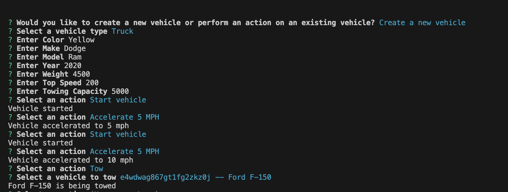
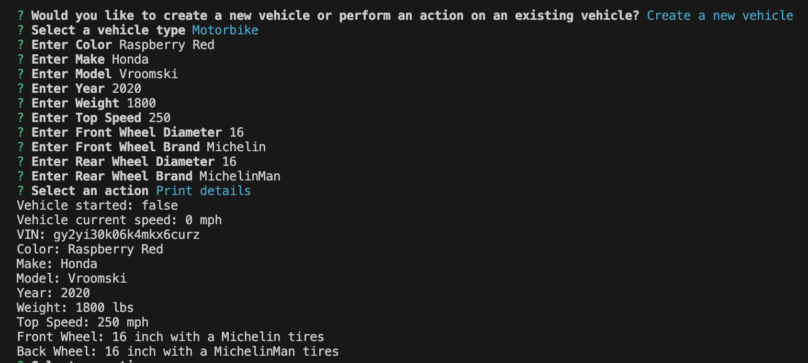

# TypeScript- Vehicle Builder


## Description
This is an interactive program that allows a user to either create a new vehicle, or select from an existing vehicle. After the vehicle is selected, users are able to perform various actions and tell the console what to do. It is important to START the vehicle before you accelerate/decelerate, and also STOPPING the vehicle will automatically bring it to 0 mph. Trucks will have the capability to tow, and Motorbikes will be able to do wheelies!


## Table of Contents
* [Description](#description)
* [Instructions](#instructions)
* [Technologies](#technologies)
* [Contribution](#contribution)
* [License](#license)
* [Links](#links)
* [Questions](#questions)


## Instructions
Using the command provided, you'll be able to use the terminal to answer a series of questions about the vehicle creation process. Please be sure to start the terminal from your Develop folder that houses all of your dependencies and package.json files

```bash
npm i 
```

```bash
npm start
```
<br>
Please see truck demo below: <br>
<br>

Please see Motorbike demo below: <br>
<br>


## Technologies
* TypeScript
* Node.js


## Contribution
Xpert Learning Assistant, Full Stack forums


## License 
This project is licensed under the MIT License

## Links

* [GitHub Repository](https://github.com/jaornelas/typescript-vehiclebuilder)
* [Walkthrough Video](https://drive.google.com/file/d/1vJpEogk0VnR-fd6eGw4FLYroBvAg6ZfI/view)

## Questions
If you have any additional questions about the project, please feel free to reach me at:
- GitHub: [jaornelas](https://github.com/jaornelas)
- Email:  [ornelalf001@gmail.com](mailto:ornelalf001@gmail.com)


